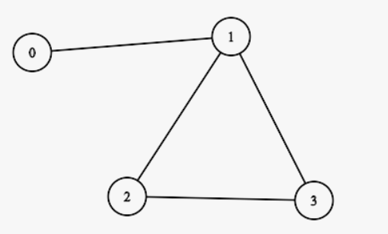
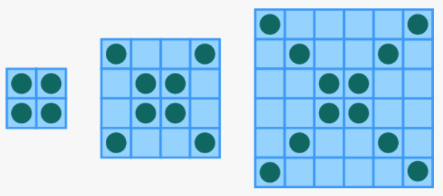

                                        Ex1.
Some basic arithmetic operators are 
- '+'
- '-' 
- '*'
- '/' 
- %. 

In this challenge you will be given three parameters, num1, num2, and an operator. 
Use the operator on parameters num1 and num2.

**- There will be no division by zero.**

                                        Ex2.
Write a function that stutters a word as if someone is struggling to read it. 
The first two letters are repeated twice with an ellipsis ... and space after each, 
and then the word is pronounced with a question mark ?.

**- Assume all inputs are in lower case and at least two-character long.**

                                        Ex3.
Create a method that accepts a string (of a person's first and last name) and returns a string with the first and last name swapped.

**-There will be exactly one space between the first and last name.**

                                        Ex4.
Write a function that returns true if two rooks can attack each other, and false otherwise.

**- Assume no blocking pieces.**

**- Two rooks can attack each other if they share the same row (letter) or column (number).**

                                        Ex5.
Create a function that takes a number as an argument and returns "Fizz", "Buzz" or "FizzBuzz".

- If the number is a multiple of 3 the output should be "Fizz".
- If the number given is a multiple of 5, the output should be "Buzz".
- If the number given is a multiple of both 3 and 5, the output should be "FizzBuzz".
- If the number is not a multiple of either 3 or 5, the number should be output on its own as shown in the examples below.
- The output should always be a string even if it is not a multiple of 3 or 5.

**- Try to be precise with how you spell things and where you put the capital letters.**

                                        Ex6.
Given a total due and an array representing the amount of change in your pocket, determine whether you are able to pay for the item. 
Change will always be represented in the following order: quarters, dimes, nickels, pennies.

**Ex: changeEnough([25, 20, 5, 0], 4.25) should yield true, since having 25 quarters, 20 dimes, 5 nickels and 0 pennies gives you 6.25 + 2 + .25 + 0 = 8.50.**

**- quarter: 25 cents / $0.25**

**- dime: 10 cents / $0.10**

**- nickel: 5 cents / $0.05**

**- penny: 1 cent / $0.01**

                                        Ex7.

Create a function that takes an array and returns the difference between the biggest and smallest numbers.

                                        Ex8.

Create a function that takes three integer arguments (a, b, c) and returns the amount of integers which are of equal value.

**Function must return 0, 2 or 3.**

                                        Ex9.

Create a method that takes a string as its argument and returns the string in reversed order.

                                        Ex10.

A word has been split into a left part and a right part. Re-form the word by adding both halves together, changing the first character to an uppercase letter.

                                        Ex11.

You hired three programmers and you (hopefully) pay them. 
Create a function that takes three numbers (the hourly wages of each programmer) and returns the difference between the highest-paid programmer and the lowest-paid.

                                        Ex12.

Create a method that takes an array of 10 integers (between 0 and 9) and returns a string of those numbers formatted as a phone number 
**(e.g. (555) 555-5555)**.

                                        Ex13.
A graph is a set of nodes along with a set of edges connecting the nodes.
Graphs can be directed or undirected. In a directed graph, each edge has a direction whereas, in an undirected graph, edges do not have direction.
The graph above is an undirected graph.
Two nodes in a graph are adjacent if there is an edge between them. 
In the above example, nodes 0 and 1 are adjacent, but 0 and 2 are not adjacent.
We can encode graphs using an adjacency matrix. 
An adjacency matrix for a graph with "n" nodes is an "n * n" matrix where the entry at row "i" and column "j" is a 0 if nodes "i" and "j" are not adjacent, and 1 if nodes "i" and "j" are adjacent.

In the example above, the adjacency matrix looks like:

{ 0, 1, 0, 0 },
{ 1, 0, 1, 1 },
{ 0, 1, 0, 1 },
{ 0, 1, 1, 0 }

Your task is to determine if two nodes are adjacent in an undirected graph when given the adjacency matrix and the two nodes.

Ex.

Adjacency Matrix:

**{ 0, 1, 0, 0 },**

**{ 1, 0, 1, 1 },**

**{ 0, 1, 0, 1 },**

**{ 0, 1, 1, 0 }**

**- Nodes 0,1 should return true.**

**- Nodes 0,2 should return false.**

                                        Ex14.

Create a function that takes a string and returns the number (count) of vowels contained within it.

**- a, e, i, o, u are considered vowels (not y).**

**All test cases are one word and only contain letters.**

                                        Ex15.
---------------------------------------------

                                        Ex16.
Create a function that takes two numbers as arguments *(num, length)* and returns an array of multiples of num until the array length reaches length.

**Notice that num is also included in the returned array.**

                                        Ex17.

Given the shortest side of a 30° by 60° by 90° triangle, find out the other two sides. 
Return the longest side and medium-length side in that order.

**- 30° by 60° by 90° triangles always follow this rule: let's say the shortest side length is x units, 
the hypotenuse would be 2x units and the other side would be x * square root of 3.**

**- The results in the Tests are rounded up to 2 decimal places.**

**- Return the result as an array.**

                                        Ex18.

There's a great war between the even and odd numbers. Many numbers already lost their lives in this war and it's your task to end this. 
You have to determine which group sums larger: the evens, or the odds. 
The larger group wins.

Create a function that takes an array of integers, sums the even and odd numbers separately, 
then returns the difference between the sum of the even and odd numbers.

**The given array contains only positive integers.**

                                        Ex19.

Create a function that takes an integer and outputs an n x n square solely consisting of the integer n.

**- n >= 0**

**- If n = 0, return an empty array**

                                        Ex20.

Write a function that finds the sum of an array. Make your function recursive.

**- Return 0 for an empty array.**

                                        Ex21.

Create a function that counts the number of times a particular letter shows up in the word search.

**Always be an array with five sub-arrays.**

                                        Ex22.

Write a function that does the following for the given values: add, subtract, divide and multiply. These are simply referred to as the basic arithmetic operations. 
The variables have to be defined, but in this challenge they will be defined for you. 
All you have to do is check the variables, do some string to integer conversions, use some if conditions, and apply the arithmetic operation.

**- The numbers and operation are given as strings and should result in an integer value.**

**- If the operation results in an ArithmeticException, then return Integer.MIN_VALUE (e.g. division by zero).**

**- Division results will be rounded down to its integral part.**

                                        Ex23. "Quadratic Equation"
Create a function to find only the root value of x in any quadratic equation ax^2 + bx + c.
The function will take three arguments:

**a as the coefficient of x^2**

**b as the coefficient of x**

**c as the constant term**

                                        Ex24. "Digits Count"

Create a function that counts the integer's number of digits.

**Examples:**

**count(4666) ➞ 4**

**count(544) ➞ 3**

**count(318) ➞ 3**

**solve this without using strings.**

                                        Ex25. "Fix Calculator"
Mubashir created a function that takes two numbers a and b and an operator o. 
Function should return the result of the corresponding mathematical function on both numbers. 
If the operator is not one of the specified characters +, -, /, *, or if there is a division by zero, the function should return null. 
Help him by fixing the code in the code tab to pass this challenge.

                                        Ex26. "Adding Numbers"
Create a function that takes two number strings and returns their sum as a string.

Ex:

**add("10", "80") ➞ "90"**

**add("", "20") ➞ "Invalid Operation"**

**- Return "Invalid Operation" If either input is "" or null.**

------------------------------------------

***- problem with test number 11***

                                        Ex27. "Rock, Paper, Scissors"

                                        Ex28. "The Empty Square Sequence"
In the image below, squares are either empty or filled with a circle.

Create a function that takes a number step (which equals HALF the width of a square) and returns the amount of empty squares. 
The image shows the squares with step 1, 2 and 3. The return value is the number of cells not on a diagonal, which is 0 for the first square, 8 for the second, and 24 for the third.

emptySq(1) ➞ 0

emptySq(3) ➞ 24

emptySq(10) ➞ 360